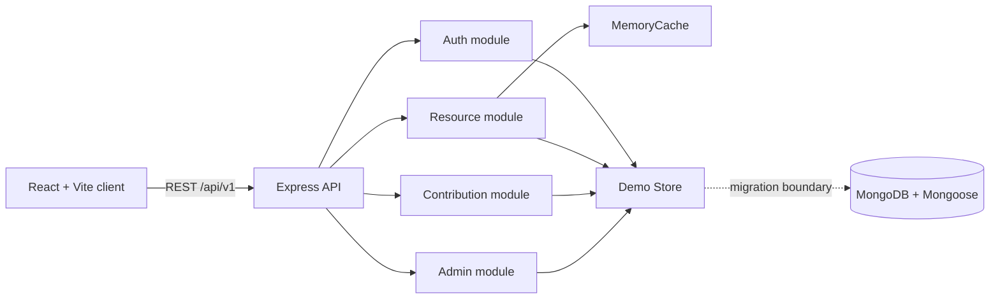
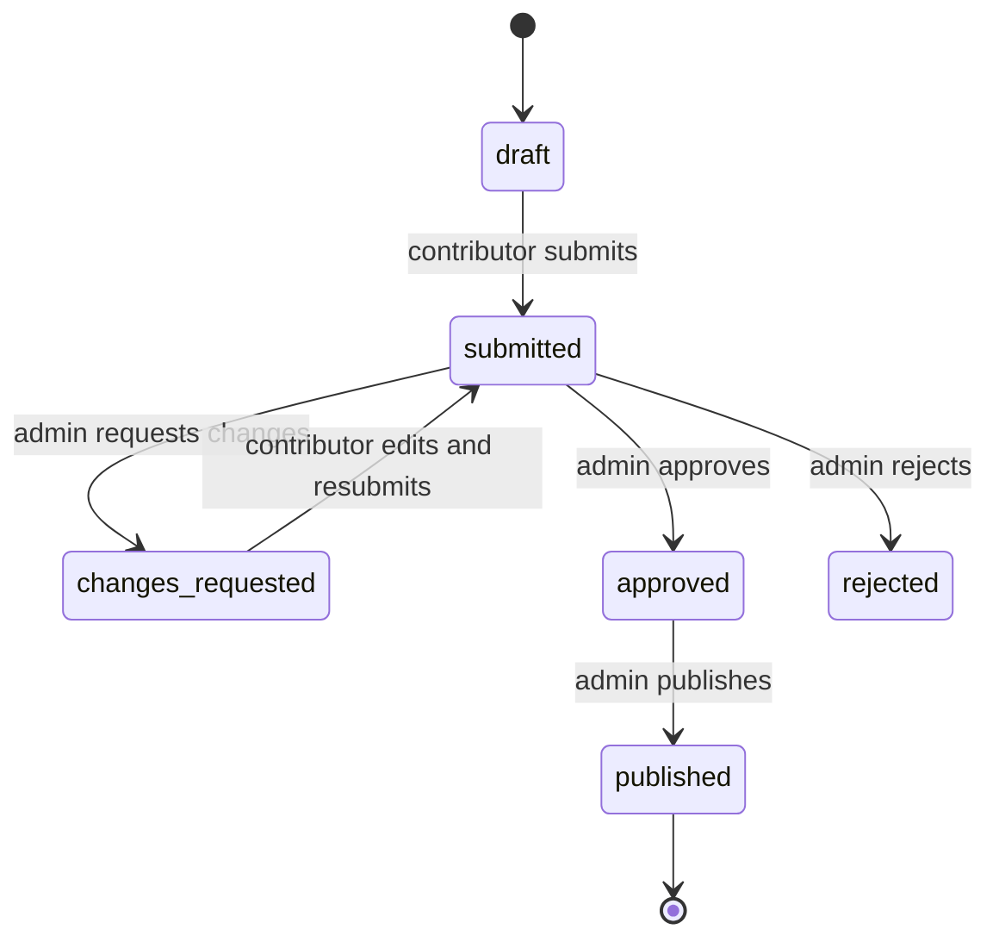

# DevShelf Architecture

## Product boundary

DevShelf is a modular monolith for discovering, saving, organizing, contributing, and moderating developer resources. The initial MVP optimizes for fast local demonstration and a clean migration path to MongoDB and distributed infrastructure.

## System overview



## Layer responsibilities

| Layer | Current location | Responsibility |
| --- | --- | --- |
| Presentation | `client/src/main.jsx`, `client/src/styles.css` | Routes, page composition, forms, loading/empty states, responsive UI |
| Transport | `server/src/index.js` | HTTP routes, response envelopes, request IDs, rate limiting |
| Application | route handlers today; extract next | Validation, authorization, workflow transitions, cache invalidation |
| Domain | `server/src/store.js` and models | Resource, user, collection, submission rules and state |
| Infrastructure | `server/src/cache.js`, Docker files | Cache, runtime configuration, container startup |
| Persistence | `server/src/models/` | Mongoose schema boundary for the MongoDB implementation |

## Runtime request flow

### Public resource search

1. Browser updates query parameters for search, category, and difficulty.
2. Client calls `GET /api/v1/resources`.
3. API builds a deterministic cache key from query parameters.
4. `MemoryCache` returns a non-expired result when present.
5. On a miss, the store filters published resources and applies pagination.
6. The response includes `success`, `message`, `data`, and pagination metadata.
7. Resource writes invalidate the `resources:` prefix so the next read is fresh.

### Authentication

1. Client submits email and password over the local API.
2. Server validates the account and compares the bcrypt password hash.
3. Server issues a short-lived JWT containing user ID, role, and display name.
4. Axios attaches the token as a Bearer header to subsequent requests.
5. `requireAuth` verifies the token; `requireRole` enforces admin-only routes.
6. Production hardening should move refresh tokens to secure, httpOnly cookies with rotation.

### Contribution and moderation



The current UI covers draft creation, submission, admin approval, request-changes status, and publishing. The backend has update/submit endpoints; the contributor edit-and-resubmit UI is the next workflow increment.

## Data model relationships

```text
User 1 ─── * Bookmark * ─── 1 Resource
User 1 ─── * Collection 1 ─── * Resource
User 1 ─── * Submission ───> Resource (after publish)
User 1 ─── * AuditLog (planned persistence)
Category 1 ─── * Resource
```

## Cache design

`MemoryCache` supports key/value storage, TTL expiry, manual invalidation, prefix invalidation, hit/miss counters, and size statistics. It is process-local and appropriate only for a single-instance demo. A multi-instance deployment requires a distributed cache and shared invalidation.

## Security boundaries

- Public APIs only expose `published` resources.
- Protected user APIs require a valid JWT.
- Admin APIs require the `admin` role.
- Passwords are hashed and never returned in response data.
- Request bodies are size-limited and validated.
- Helmet, CORS, rate limiting, generic auth errors, and request IDs are enabled.
- Secrets and environment variables must never be logged or committed.

## Scaling path

1. Replace `store.js` operations with repositories backed by Mongoose.
2. Add MongoDB indexes from the model requirements.
3. Persist submissions, ratings, collections, and audit logs.
4. Replace process-local memory cache with a distributed cache.
5. Add object storage for uploads and a background queue for email/moderation work.
6. Add observability with structured logs, metrics, traces, and alerting.

## Architecture decisions

- Modular monolith over microservices: lower operational overhead for the startup MVP.
- REST over GraphQL: simple public contract and straightforward caching.
- In-memory demo store: zero external dependency for a same-day demo, behind a replaceable boundary.
- No Redis in the initial version: the product explicitly calls for a reusable local cache first.
