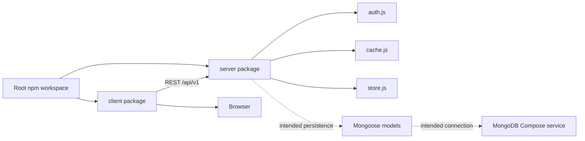
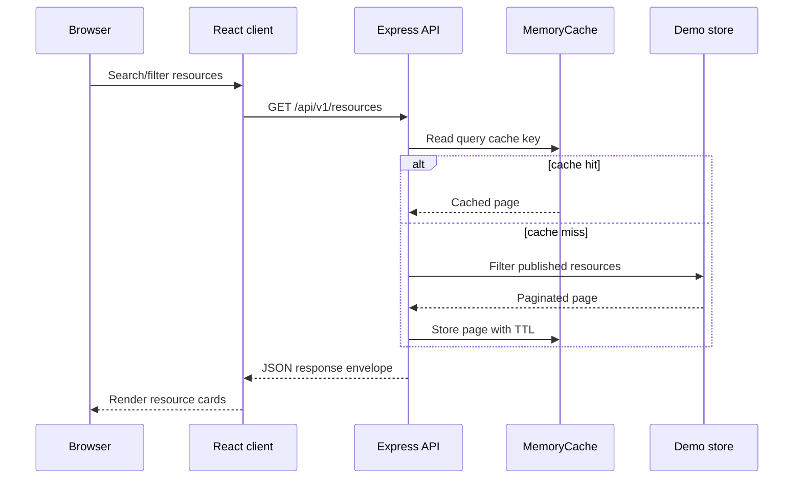
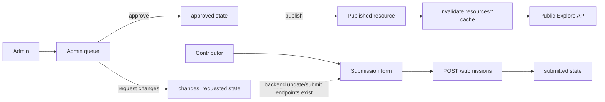
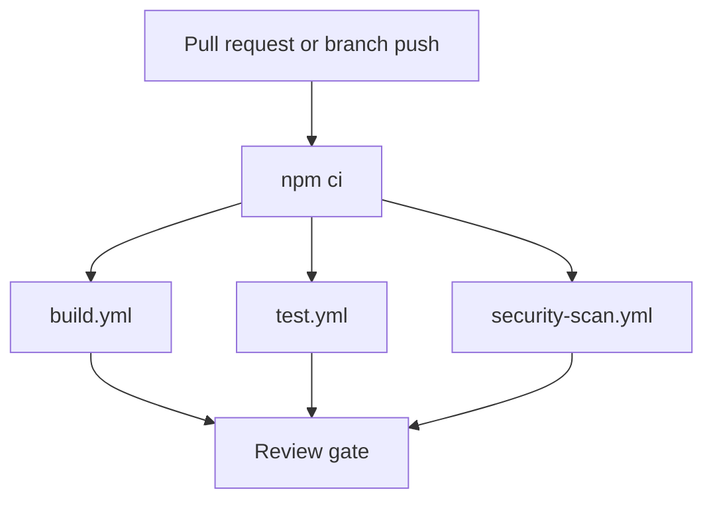

# DevShelf Dependency Graph

These diagrams represent relationships verified from the current repository.

## Workspace and runtime relationship

## Public request flow

## Contribution and publishing flow

## CI dependency relationship

The existing `.github/workflows/ci.yml` remains as a combined legacy validation workflow; the separated workflows provide explicit governance checks without changing application code.
